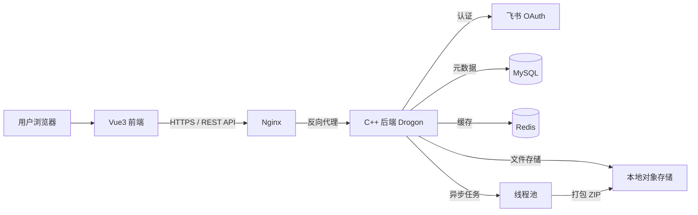

# Pan-Ult

> 一个面向团队内部的高性能文件分享网盘，支持飞书快捷登录、秒传、断点续传、多选打包 ZIP 下载与批量操作。

[](https://isocpp.org/)
[](https://github.com/drogonframework/drogon)
[](https://vuejs.org/)
[](https://www.mysql.com/)
[](https://redis.io/)
[](LICENSE)

---

## 📖 简介

Pan-Ult 是一个轻量级、高性能的团队文件分享网盘系统。后端采用 **C++17 + Drogon** 构建，前端使用 **Vue 3 + TypeScript**，集成 **飞书 OAuth 2.0** 一键登录。系统支持文件/文件夹管理、秒传、分片上传、断点续传、分享链接、回收站，以及**多选文件打包 ZIP 下载**和批量操作，适合作为团队内部的文件协作基础设施。

---

## ✨ 功能特性

- 🔐 **飞书快捷登录**：基于 OAuth 2.0 授权码模式，自动创建本地用户并签发 JWT。
- 📁 **文件与文件夹管理**：创建、重命名、复制、移动、删除，支持多级目录。
- ⚡ **秒传**：基于 SHA-256 内容寻址，相同文件秒级复用，节省存储与带宽。
- 📤 **分片上传与断点续传**：大文件分片并发上传，中断后可继续，支持上传会话恢复。
- 📦 **多选打包 ZIP 下载**：勾选多个文件/文件夹，后台异步打包，实时进度，保留目录结构。
- 🔗 **分享链接**：生成带提取码和有效期的分享链接，支持匿名访问与下载。
- 🗑️ **回收站**：软删除，支持恢复与彻底删除，30 天自动清理。
- 🚀 **高性能后端**：epoll + 多线程 Reactor + 自研线程池 + MySQL 连接池 + 异步日志。
- 🧩 **批量操作**：批量删除、移动、复制、分享，单次最多 100 项。
- 🎨 **现代化前端**：天蓝色与淡紫色主题，响应式布局，网格/列表视图切换。

---

## 🛠️ 技术栈

| 层次 | 技术 |
| :--- | :--- |
| 后端语言 | C++17 |
| HTTP 框架 | Drogon |
| 网络模型 | epoll + 多线程 Reactor |
| 并发 | 自研线程池、`std::thread`、`mutex`、`condition_variable`、`atomic` |
| 数据库 | MySQL 8.0（连接池） |
| 缓存 | Redis（会话、分享码、任务进度） |
| 存储 | 本地文件系统（SHA-256 内容寻址） |
| 认证 | 飞书 OAuth 2.0 + JWT |
| 前端 | Vue 3 + TypeScript + Vite + Pinia + Element Plus |
| 构建 | CMake、Make |
| 测试 | GTest、Python 自动化测试 |
| 部署 | Nginx、systemd、Docker |

---

## 🏗️ 系统架构



---

## 📂 项目结构

```
pan-ult/
├── backend/                 # C++ 后端
│   ├── src/
│   │   ├── main.cpp
│   │   ├── common/          # 配置、日志、Result、错误码
│   │   ├── controller/      # HTTP 路由
│   │   ├── service/         # 业务逻辑
│   │   ├── repository/      # 数据访问接口与 MySQL 实现
│   │   ├── domain/          # 实体类
│   │   ├── infrastructure/  # 飞书、JWT、存储、哈希、DB
│   │   ├── concurrency/     # 线程池、异步日志
│   │   └── middleware/      # JWT 过滤器
│   ├── config/
│   └── database/
├── frontend/                # Vue3 + TS 前端
│   ├── src/
│   │   ├── api/
│   │   ├── components/
│   │   ├── layout/
│   │   ├── store/
│   │   ├── views/
│   │   └── utils/
│   └── package.json
├── tests/                   # GTest + Python 测试
├── deploy/                  # Nginx / systemd / Docker
├── docs/                    # 需求与 API 文档
└── CMakeLists.txt
```

---

## 🚀 快速开始

### 环境要求

- Linux（Ubuntu 22.04 推荐）
- GCC 9+、CMake 3.16+
- MySQL 8.0+
- Redis 6.0+
- Node.js 18+、npm/pnpm
- OpenSSL 开发库

### 1. 克隆仓库

```bash
git clone https://github.com/yourname/pan-ult.git
cd pan-ult
```

### 2. 初始化数据库

```bash
mysql -u root -p < backend/database/init_db.sql
```

### 3. 配置后端

复制配置模板并填入真实信息（或使用环境变量）：

```bash
cp backend/config/server.conf.template backend/config/server.conf
cp backend/config/feishu.conf.template backend/config/feishu.conf
```

编辑 `server.conf` 设置 MySQL、Redis、JWT 密钥等；  
编辑 `feishu.conf` 填入飞书 App ID 与 App Secret。

### 4. 构建并启动后端

```bash
mkdir build && cd build
cmake ..
make -j$(nproc)
./bin/pan_ult_server
```

### 5. 启动前端

```bash
cd frontend
npm install
npm run dev
```

默认前端运行在 `http://localhost:5173`，后端 `http://localhost:8080`。

### 6. 配置飞书回调

在飞书开放平台创建自建应用，配置重定向 URL：

```
http://localhost:8080/api/auth/feishu/callback
```

并申请 `contact:user.base:readonly` 权限。

---

## 📚 API 文档

详细接口文档请参阅：

- [API 接口文档](docs/api.md)
- [前端需求文档](docs/frontend.md)
- [后端设计文档](docs/backend.md)

核心接口概览：

| 模块 | 接口 | 说明 |
| :--- | :--- | :--- |
| 认证 | `GET /api/auth/feishu/url` | 获取飞书授权链接 |
| 认证 | `GET /api/auth/feishu/callback` | 飞书回调，换取 JWT |
| 文件 | `GET /api/files` | 文件/文件夹列表 |
| 文件 | `POST /api/files/upload` | 小文件上传 |
| 文件 | `POST /api/files/upload/init` | 分片上传初始化 |
| 文件 | `GET /api/files/{id}/download` | 单文件下载 |
| 打包 | `POST /api/files/download/package` | 创建打包任务 |
| 打包 | `GET /api/files/download/package/{task_id}` | 查询打包进度 |
| 分享 | `POST /api/shares` | 创建分享 |
| 分享 | `GET /api/share/{code}` | 访问分享 |

---

## 🧪 测试

```bash
# 后端单元测试
cd build && ctest

# Python 端到端测试
python3 tests/e2e/test_upload_download.py
```

---

## 📈 性能目标

| 场景 | 目标 |
| :--- | :--- |
| 文件列表查询 | QPS 5000+，P99 < 50ms |
| 小文件上传 | QPS 500+，P99 < 200ms |
| 单文件下载 | QPS 1000+，P99 < 100ms |
| 并发上传 | 500+ 并发无错误 |
| 秒传命中 | 响应 < 50ms |

---

## 🐳 部署

### 使用 Docker Compose

```bash
cd deploy/docker
docker-compose up -d
```

### 使用 Nginx + systemd

参考 `deploy/nginx/pan-ult.conf` 和 `deploy/systemd/pan-ult.service`。

---

## 🤝 贡献

欢迎提交 Issue 和 Pull Request。请确保：

1. 代码符合 `.clang-format` 规范。
2. 新增功能附带单元测试。
3. 更新相关文档。

---

## 📄 许可证

本项目采用 [MIT](LICENSE) 许可证。

---

## 🙏 致谢

- [Drogon](https://github.com/drogonframework/drogon)
- [Vue.js](https://vuejs.org/)
- [Element Plus](https://element-plus.org/)
- [飞书开放平台](https://open.feishu.cn/)

---

**Pan-Ult** —— 让团队文件分享更简单、更快速。